# Getting Started with the Raspberry Pi on The Edge and .NET 5 

The IoT Edge Version of .NET 5 Sample app:  https://github.com/IoT-Hands-On-Labs-ZA/RaspberryPiDotNet

## IoT Central

Create an Application in IoT Central 
[IoT Central](https://apps.azureiotcentral.com/)

## IoT Edge Simulated Iot Edge Sensor Tutorial

Tutorial on how to create an IoT Edge device in IoT Central 
[IoT Central Simulated Sensor](https://docs.microsoft.com/en-us/azure/iot-central/core/tutorial-add-edge-as-leaf-device)

## Setting up your Physical Pi to connect to IoT Central

Update the **PiDHTEnvMonitorManifest.json** file with the credentials to your Container Repository.

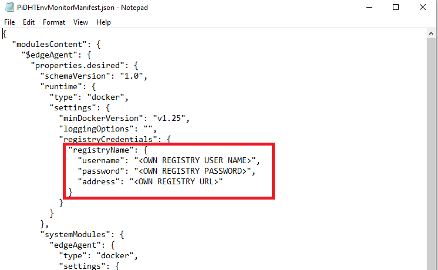

Create a new Device Template \ IoT Edge Device within IoT Central abd provide the **PiDHTEnvMonitorManifest.json** file.
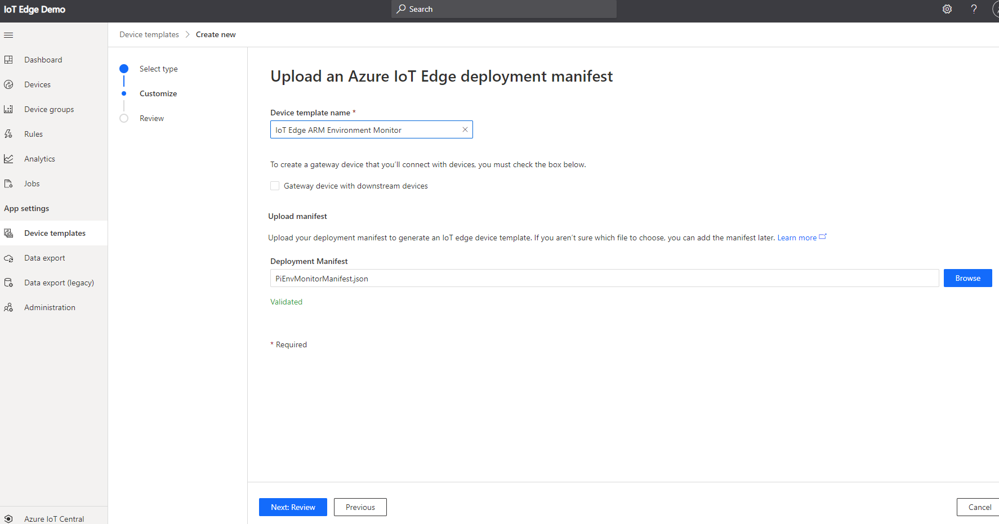

Create Interface within the Device Template
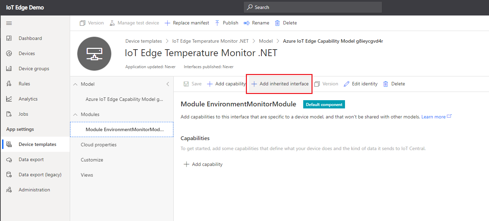

Import Interface with the provided **DeviceTemplateInterface.json** file

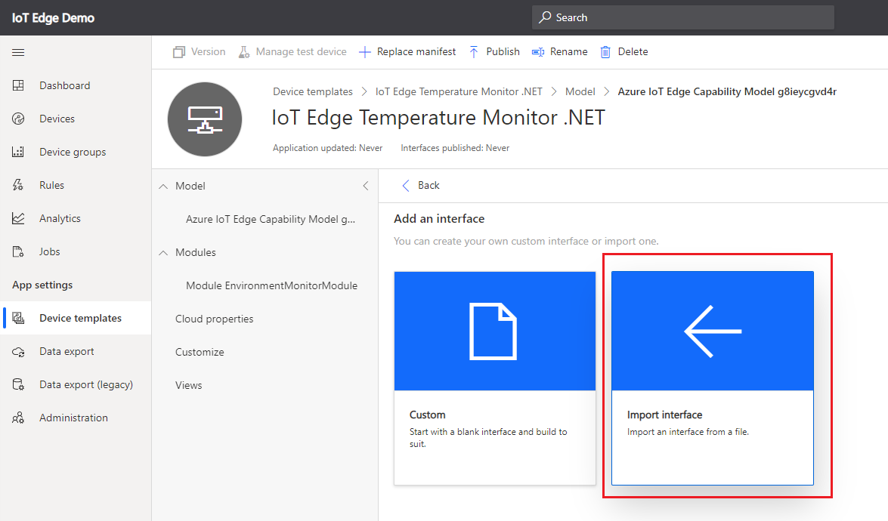

The Interface is imported.

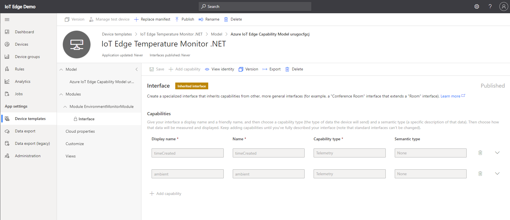

Publish the Template

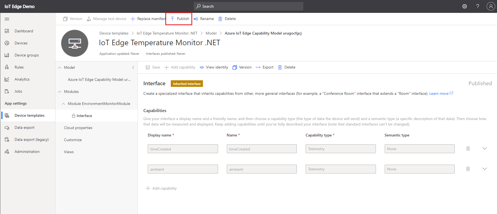

Create a new Device with created template

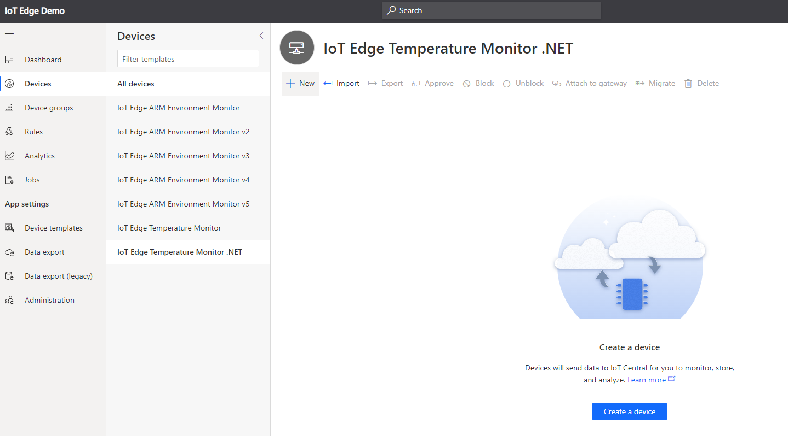

Save new device

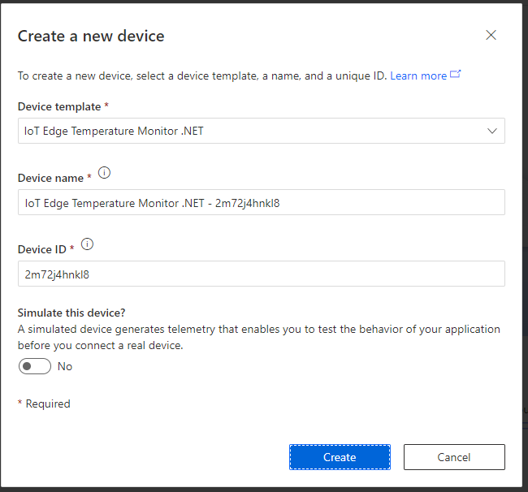

Choose Device

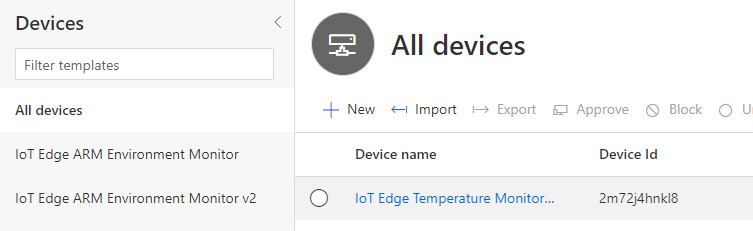

View Connection information

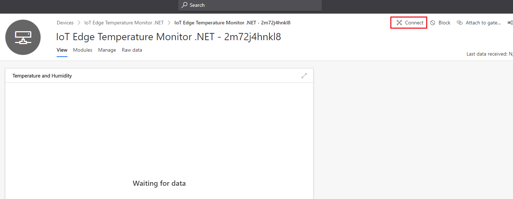

Note down Device Information 

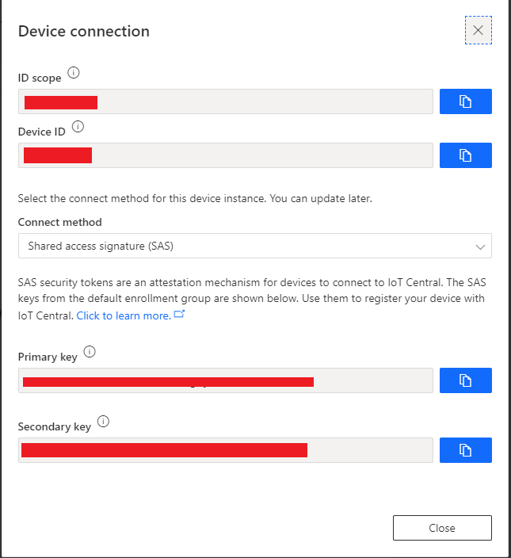

## Install IoT Edge Runtime on Raspberry Pi

Tutorial on how to Install IoT Edge Runtime on the Raspberry Pi
[Iot Edge Runtime Install](https://docs.microsoft.com/en-us/azure/iot-edge/how-to-install-iot-edge?view=iotedge-2018-06&tabs=linux)

## Configure IoT Edge Runtime on Raspberry Pi for IoT Central

Edit **/etc/iotedge/config.yaml** file.  

Insert the previously noted down connection values for **scopeid**, **deviceid** and **primary key**

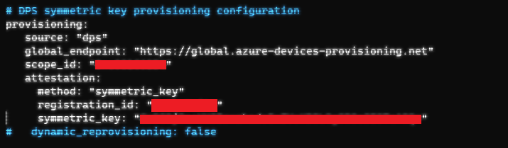

Restart IoT Edge Runtime

