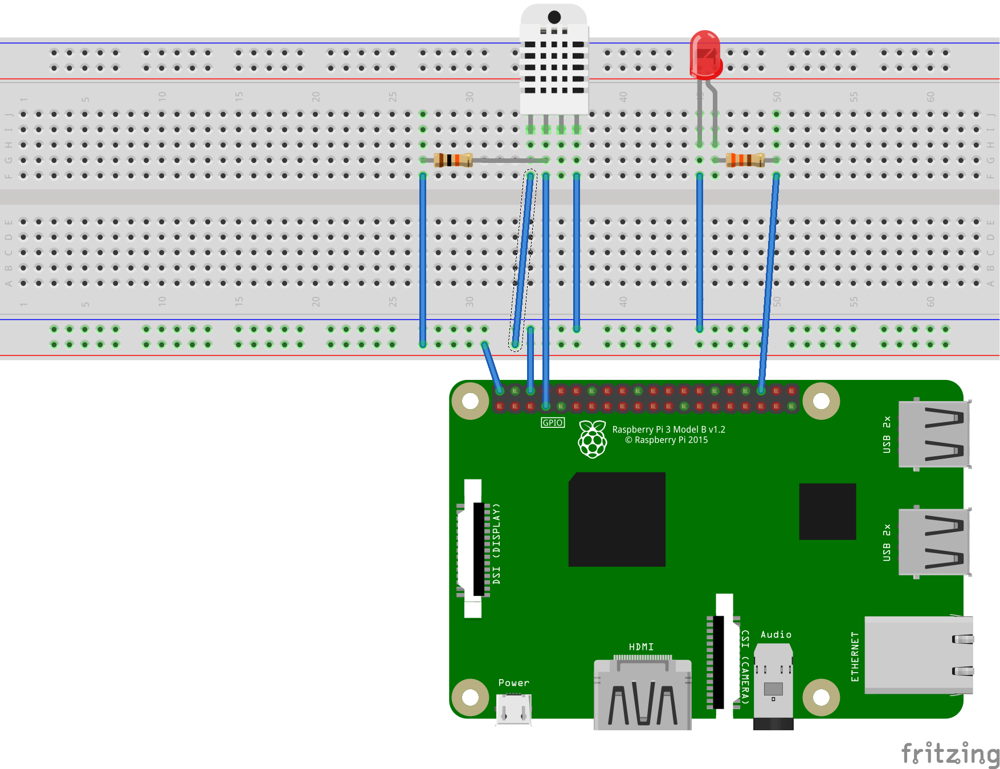

# Getting Started with the Raspberry Pi on The Edge and .NET 5 

The IoT Edge Version of .NET 5 Sample app:  https://github.com/IoT-Hands-On-Labs-ZA/RaspberryPiDotNet

## IoT Central

Create an Application in IoT Central 
[IoT Central](https://apps.azureiotcentral.com/)

## IoT Edge Simulated Iot Edge Sensor Tutorial

Tutorial on how to create an IoT Edge device in IoT Central 
[IoT Central Simulated Sensor](https://docs.microsoft.com/en-us/azure/iot-central/core/tutorial-add-edge-as-leaf-device)

